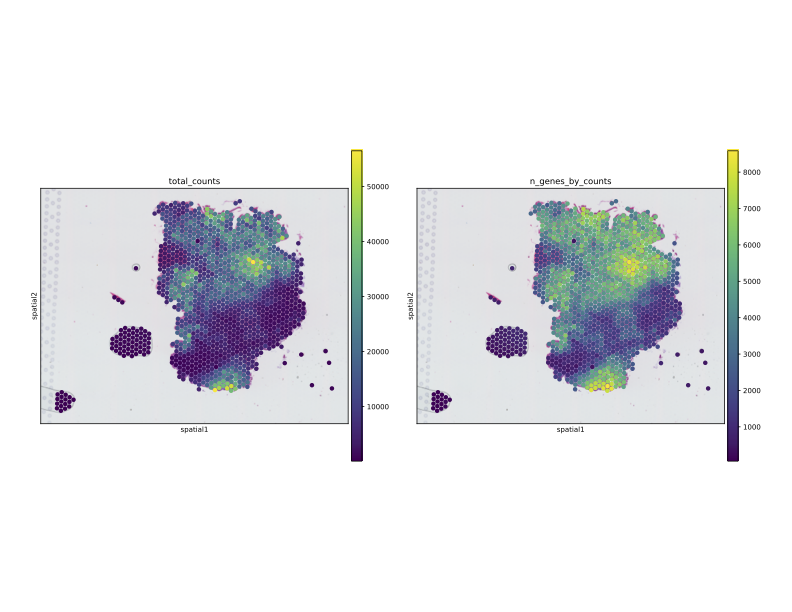
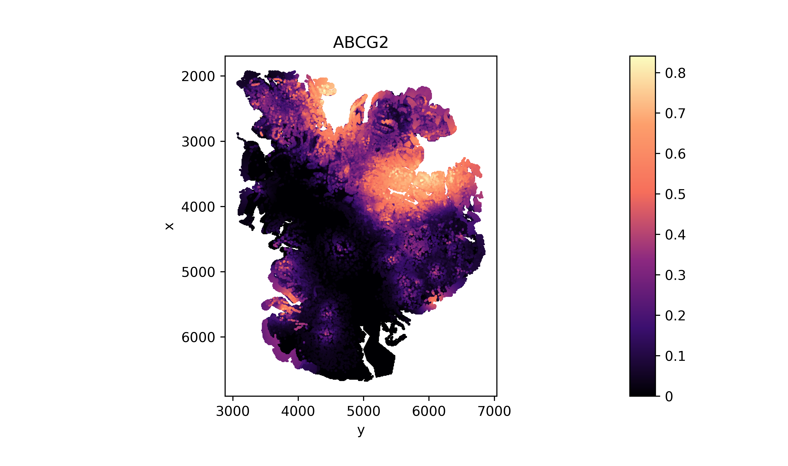
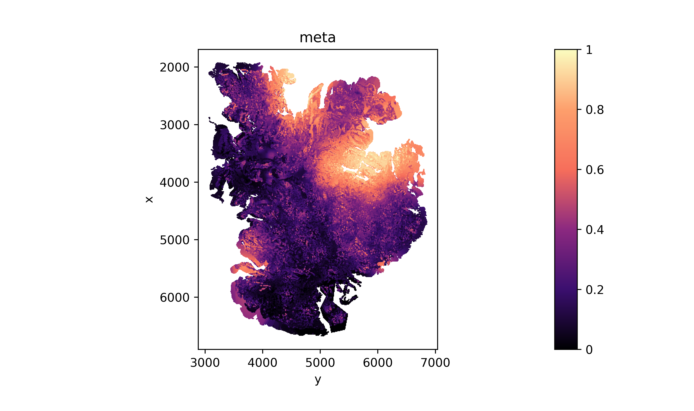
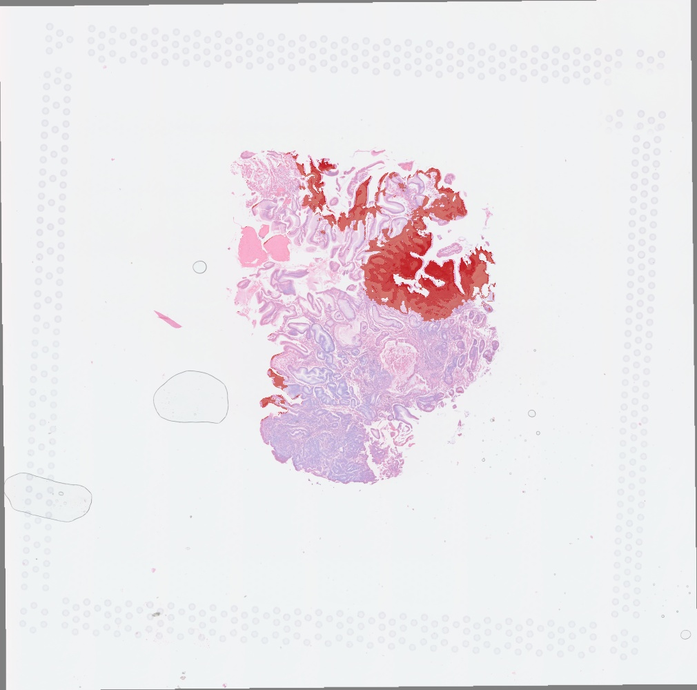
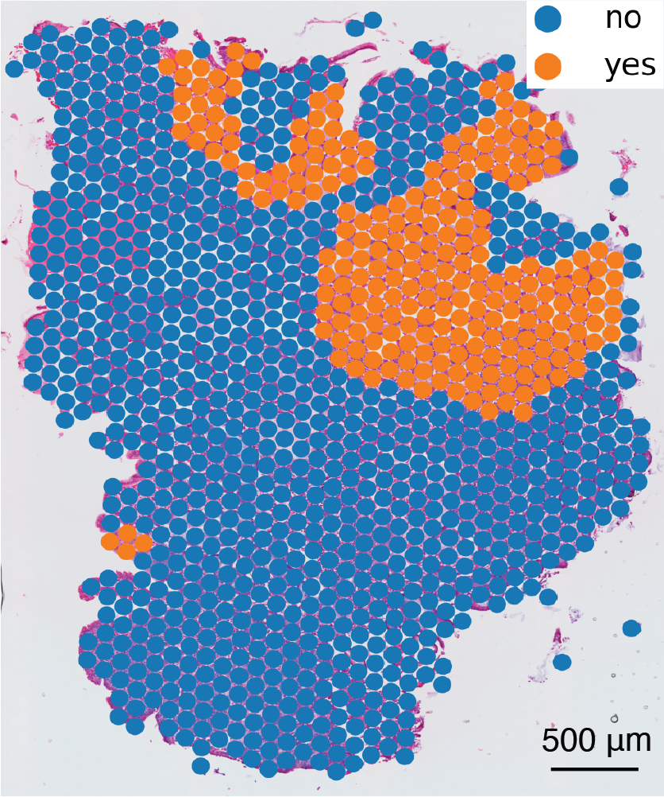
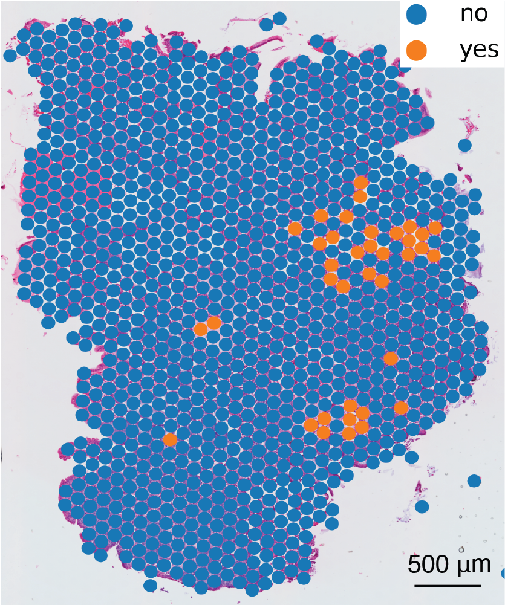
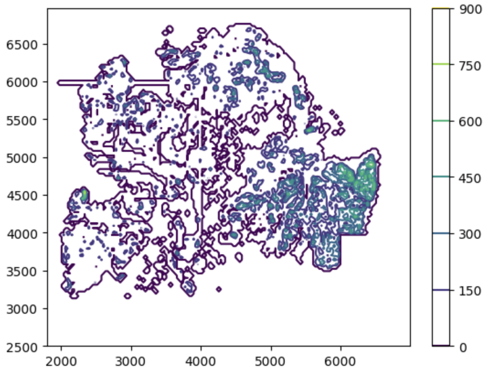
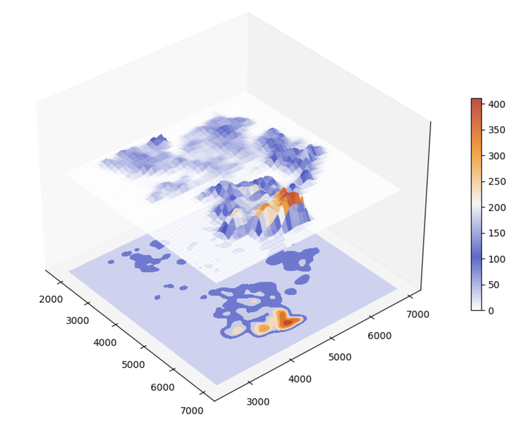

<h1><center>METI Tutorial</center></h1>

## Outline
1. [Installation]
2. [Import modules]
3. [Quality control]
4. [Read in data]
5. [Gene expression enhancement]
6. [Goblet marker gene expression]
7. [Region annotation]
8. [Segmentation]
9. [Integrarion of gene expression result with segmentation result]
10. [3D density plot]

### 1. Installation
The installation should take a few minutes on a normal computer. 

Now you can install the current release of METI by the following three ways:
#### 1 PyPI: Directly install the package from PyPI.


```python
pip install METIforST
#Note: you need to make sure that the pip is for python3，or you can install METI by
python3 -m pip install METIforST==0.2
```

### 2. Import modules

```python
import torch
import csv,re, time
import pickle
import random
import warnings
warnings.filterwarnings('ignore')
import pandas as pd
import numpy as np
from scipy import stats
from scipy.sparse import issparse
import scanpy as sc
import matplotlib.colors as clr
import matplotlib.pyplot as plt
import cv2
import TESLA as tesla
from IPython.display import Image
import scipy.sparse
import scanpy as sc
import pandas as pd
import matplotlib.pyplot as plt
import seaborn as sns
from scanpy import read_10x_h5
import PIL
from PIL import Image as IMAGE
import os
import METI as meti
import tifffile
os.environ['KMP_DUPLICATE_LIB_OK']='True'
```

```python
METI.__version__
```
### 3. Quality control
```python
adata=sc.read_visium("/tutorial/data/Spaceranger/")
spatial=pd.read_csv("/tutorial/data/Spaceranger/tissue_positions_list.csv",sep=",",header=None,na_filter=False,index_col=0)

adata
```
    AnnData object with n_obs × n_vars = 3875 × 17943
    obs: 'in_tissue', 'array_row', 'array_col'
    var: 'gene_ids', 'feature_types', 'genome'
    uns: 'spatial'
    obsm: 'spatial'

```python
adata.var_names_make_unique()
adata.var["mt"] = adata.var_names.str.startswith("MT-")
sc.pp.calculate_qc_metrics(adata, qc_vars=["mt"], inplace=True)

adata
```
    AnnData object with n_obs × n_vars = 3875 × 17943
    obs: 'in_tissue', 'array_row', 'array_col', 'n_genes_by_counts', 'log1p_n_genes_by_counts', 'total_counts', 'log1p_total_counts', 'pct_counts_in_top_50_genes', 'pct_counts_in_top_100_genes', 'pct_counts_in_top_200_genes', 'pct_counts_in_top_500_genes', 'total_counts_mt', 'log1p_total_counts_mt', 'pct_counts_mt'
    var: 'gene_ids', 'feature_types', 'genome', 'mt', 'n_cells_by_counts', 'mean_counts', 'log1p_mean_counts', 'pct_dropout_by_counts', 'total_counts', 'log1p_total_counts'
    uns: 'spatial'
    obsm: 'spatial'

```python
plt.rcParams["figure.figsize"] = (8, 8)
sc.pl.spatial(adata, img_key="hires", color=["total_counts", "n_genes_by_counts"], size = 1.5, save = 'UMI_count.png')
```

**UMI counts**


### 4. Read in data
The current version of METI requres three input data.
1. The gene expression matrix(n by k): expression_matrix.h5;
2. Spatial coordinateds of samplespositions.txt;
3. Histology image(optional): histology.tif, can be tif or png or jepg.

```python
#================== 3. Read in data ==================#
#Read original 10x_h5 data and save it to h5ad
from scanpy import read_10x_h5
adata = read_10x_h5("../tutorial/data/filtered_feature_bc_matrix.h5")
spatial=pd.read_csv("../tutorial/data/tissue_positions_list.csv",sep=",",header=None,na_filter=False,index_col=0) 
adata.obs["x1"]=spatial[1]
adata.obs["x2"]=spatial[2]
adata.obs["x3"]=spatial[3]
adata.obs["x4"]=spatial[4]
adata.obs["x5"]=spatial[5] 
adata.obs["array_x"]=adata.obs["x2"]
adata.obs["array_y"]=adata.obs["x3"]
adata.obs["pixel_x"]=adata.obs["x4"]
adata.obs["pixel_y"]=adata.obs["x5"]
#Select captured samples
adata=adata[adata.obs["x1"]==1]
adata.var_names=[i.upper() for i in list(adata.var_names)]
adata.var["genename"]=adata.var.index.astype("str")
adata.write_h5ad("../tutorial/data/1957495_data.h5ad")

#Read in gene expression and spatial location
counts=sc.read("../tutorial/data/1957495_data.h5ad")
#Read in hitology image
PIL.Image.MAX_IMAGE_PIXELS = None
img = IMAGE.open(r"../tutorial/data/histology.tif") 
img = np.array(img)

#if your image has 4 dimensions, only keep first 3 dims
img=img[...,:3]
```

### 5. Gene expression enhancement
#### 5.1 Preprocessing
```python
resize_factor=1000/np.min(img.shape[0:2])
resize_width=int(img.shape[1]*resize_factor)
resize_height=int(img.shape[0]*resize_factor)
counts.var.index=[i.upper() for i in counts.var.index]
counts.var_names_make_unique()
counts.raw=counts
sc.pp.log1p(counts) # impute on log scale
if issparse(counts.X):counts.X=counts.X.A
```
#### 5.2 Contour detection
```python
# Detect contour using cv2
cnt=tesla.cv2_detect_contour(img, apertureSize=5,L2gradient = True)

binary=np.zeros((img.shape[0:2]), dtype=np.uint8)
cv2.drawContours(binary, [cnt], -1, (1), thickness=-1)
#Enlarged filter
cnt_enlarged = tesla.scale_contour(cnt, 1.05)
binary_enlarged = np.zeros(img.shape[0:2])
cv2.drawContours(binary_enlarged, [cnt_enlarged], -1, (1), thickness=-1)
img_new = img.copy()
cv2.drawContours(img_new, [cnt], -1, (255), thickness=20)
img_new=cv2.resize(img_new, ((resize_width, resize_height)))
cv2.imwrite('../tutorial/data/cnt_1957495.jpg', img_new)
Image(filename='../tutorial/data/cnt_1957495.jpg')
```

#### 5.3 Gene expression enhancement
```python
#Set size of superpixel
res=40
# Note, if the numer of superpixels is too large and take too long, you can increase the res to 100
enhanced_exp_adata=tesla.imputation(img=img, raw=counts, cnt=cnt, genes=counts.var.index.tolist(), shape="None", res=res, s=1, k=2, num_nbs=10)
enhanced_exp_adata.write_h5ad("../tutorial/data/enhanced_exp.h5ad")
```
    Total number of sudo points:  92844
    Calculating spot 0
    Calculating spot 1000
    Calculating spot 2000
    Calculating spot 3000
    Calculating spot 4000
    Calculating spot 5000
    ...
    --- 280.4760136604309 seconds ---
    Imputing spot 0
    Imputing spot 1000
    Imputing spot 2000
    Imputing spot 3000
    Imputing spot 4000
    Imputing spot 5000
    ...

### 6. Goblet marker gene expression
```python
#================ determine if markers are in ===============#
enhanced_exp_adata=sc.read("..tutorial/data/enhanced_exp.h5ad")
markers = ["MS4A10", "MGAM", "CYP4F2", "XPNPEP2", "SLC5A9", "SLC13A2", "SLC28A1", "MEP1A", "ABCG2", "ACE2"]
for i in range(len(markers)):
    if markers[i] in enhanced_exp_adata.var.index: print("yes")
    else: print(markers[i])
```

```python
save_dir="..tutorial/data/Goblet/"
if not os.path.exists(save_dir):os.mkdir(save_dir)
```

```python
#================ Plot gene expression image ===============#
markers = ["MS4A10", "MGAM", "CYP4F2", "XPNPEP2", "SLC5A9", "SLC13A2", "SLC28A1", "MEP1A", "ABCG2", "ACE2"]
for i in range(len(markers)):
    cnt_color = clr.LinearSegmentedColormap.from_list('magma', ["#000003",  "#3b0f6f",  "#8c2980",   "#f66e5b", "#fd9f6c", "#fbfcbf"], N=256)
    g=markers[i]
    enhanced_exp_adata.obs[g]=enhanced_exp_adata.X[:,enhanced_exp_adata.var.index==g]
    fig=sc.pl.scatter(enhanced_exp_adata,alpha=1,x="y",y="x",color=g,color_map=cnt_color,show=False,size=10)
    fig.set_aspect('equal', 'box')
    fig.invert_yaxis()
    plt.gcf().set_dpi(600)
    fig.figure.show()

    plt.savefig(save_dir + str(markers[i]) + ".png", dpi=600)
    plt.close()
```
**Gene expression**

```python
#================ Plot meta gene expression image ===============#
enhanced_exp_adata=sc.read("/Users/jjiang6/Desktop/UTH/MDA GRA/Spatial transcriptome/Cell Segmentation/With Jian Hu/S1_54078/TESLA/enhanced_exp.h5ad")
genes =   ["MS4A10", "MGAM", "CYP4F2", "XPNPEP2", "SLC5A9", "SLC13A2", "SLC28A1", "MEP1A", "ABCG2", "ACE2"]
    
sudo_adata = meti.meta_gene_plot(img=img, 
                                binary=binary,
                                sudo_adata=enhanced_exp_adata, 
                                genes=genes, 
                                resize_factor=resize_factor,
                                target_size="small")

cnt_color = clr.LinearSegmentedColormap.from_list('magma', ["#000003",  "#3b0f6f",  "#8c2980",   "#f66e5b", "#fd9f6c", "#fbfcbf"], N=256)
fig=sc.pl.scatter(sudo_adata,alpha=1,x="y",y="x",color='meta',color_map=cnt_color,show=False,size=5)
fig.set_aspect('equal', 'box')
fig.invert_yaxis()
plt.gcf().set_dpi(600)
fig.figure.show()

plt.savefig(save_dir + "Goblet_meta.png", dpi=600)
plt.close()
```
**Meta gene expression**

### 7. Region annotation
```python
genes=["MS4A10", "MGAM", "CYP4F2", "XPNPEP2", "SLC5A9", "SLC13A2", "SLC28A1", "MEP1A", "ABCG2", "ACE2"]
genes=list(set([i for i in genes if i in enhanced_exp_adata.var.index ]))
#target_size can be set to "small" or "large".
pred_refined, target_clusters, c_m=meti.annotation(img=img, 
                                                    binary=binary,
                                                    sudo_adata=enhanced_exp_adata, 
                                                    genes=genes, 
                                                    resize_factor=resize_factor,
                                                    num_required=1, 
                                                    target_size="small")
#Plot
ret_img=tesla.visualize_annotation(img=img, 
                              binary=binary, 
                              resize_factor=resize_factor,
                              pred_refined=pred_refined, 
                              target_clusters=target_clusters, 
                              c_m=c_m)

cv2.imwrite(save_dir + 'IME.jpg', ret_img)
Image(filename=save_dir + 'IME.jpg')
```
**Goblet region annotation**

```python
#=====================================Convert to spot level============================================#
adata.obs["color"]=extract_color(x_pixel=(np.array(adata.obs["pixel_x"])*resize_factor).astype(np.int64), 
                                 y_pixel=(np.array(adata.obs["pixel_y"])*resize_factor).astype(np.int64), image=ret_img, beta=25)

type = []
for each in adata.obs["color"]:
    if each < adata.obs["color"].quantile(0.2):
        r = "yes"
        type.append(r)
    else:
        r = "no"
        type.append(r)

adata.obs['Goblet_GE'] = type

fig, ax = plt.subplots(figsize=(10, 10))  # Adjust the size as needed
ax.imshow(img)
ax.set_axis_off()
sc.pl.scatter(adata, x='pixel_y', y='pixel_x', color='Goblet_GE', ax=ax, size = 150, title='Goblet GE Spot Annotations')
# Save the figure
plt.savefig('./sample_results/Goblet_spot_GE.png', dpi=300, bbox_inches='tight')
```
**Goblet region annotation spot level**

### 8. Segmentation
```python
plot_dir="/rsrch4/home/genomic_med/jjiang6/Project1/S1_54078/Segmentation/NC_review_Goblet_seg/"
save_dir=plot_dir+"/seg_results"
adata= sc.read("/rsrch4/home/genomic_med/jjiang6/Project1/S1_54078/TESLA/54078_data.h5ad")

img_path = '/rsrch4/home/genomic_med/jjiang6/Project1/S1_54078/1415785-6 Bx2.tif'
img = tiff.imread(img_path)
d0, d1= img.shape[0], img.shape[1]

#=====================================Split into patched=====================================================
patch_size=400
patches=patch_split_for_ST(img=img, patch_size=patch_size, spot_info=adata.obs, x_name="pixel_x", y_name="pixel_y")
patch_info=adata.obs

# save results
pickle.dump(patches, open(plot_dir + 'patches.pkl', 'wb'))
#=================================Image Segmentation===================================
meti.Segment_Patches(patches, save_dir=save_dir,n_clusters=10)
```
    Doing:  0 / 9
    Doing:  1 / 9
    Doing:  2 / 9
    Doing:  3 / 9
    Doing:  4 / 9
    Doing:  5 / 9
    Doing:  6 / 9
    Doing:  7 / 9
    Doing:  8 / 9

```python
#=================================Get masks=================================#
pred_file_locs=[save_dir+"/patch"+str(j)+"_pred.npy" for j in range(patch_info.shape[0])]
dic_list=meti.get_color_dic(patches, seg_dir=save_dir)
masks_index=meti.Match_Masks(dic_list, num_mask_each=5, mapping_threshold1=30, mapping_threshold2=60)
```
    Doing  0
    Adding,  no match counts: 0 new rate: 1.0
    Adding,  no match counts: 1 new rate: 1.0
    Not adding,  no match counts: 4 new rate: 1.0
    Doing  1
    Not adding,  no match counts: 0 new rate: 0.6842105263157895
    Adding,  no match counts: 0 new rate: 1.0
    Not adding,  no match counts: 2 new rate: 0.6
    Doing  2
    Doing  3
    Doing  4
    Not adding,  no match counts: 0 new rate: 0.12903225806451613
    Adding,  no match counts: 1 new rate: 0.9
    Doing  5
    Doing  6
    Doing  7
    Doing  8
    
```python
masks=meti.Extract_Masks(masks_index, pred_file_locs, patch_size)
```
    Extracting mask  0
    Extracting mask  1
    Extracting mask  2
    Extracting mask  3
    Extracting mask  4
    Extracting mask  5

```python
combined_masks=meti.Combine_Masks(masks, patch_info, d0, d1)
```
    Combining mask  0
    Combining mask  1
    Combining mask  2
    Combining mask  3
    Combining mask  4
    Combining mask  5

```python
#=================================Plot masks=================================#
plot_dir = '../tutorial/data/seg_results/mask'

for i in range(masks.shape[0]): #Each mask
	print("Plotting mask ", str(i))
	ret=(combined_masks[i]*255)
	cv2.imwrite(plot_dir+'/mask'+str(i)+'.png', ret.astype(np.uint8))
```
    Plotting mask  0
    Plotting mask  1
    Plotting mask  2
    Plotting mask  3
    Plotting mask  4
    Plotting mask  5

```python
#=================================Choose one mask to detect cells/nucleis=================================#
channel=1
converted_image = combined_masks[1].astype(np.uint8)
ret, labels = cv2.connectedComponents(converted_image)
features=meti.Extract_CC_Features_each_CC(labels)

num_labels = labels.max()
height, width = labels.shape

colors = np.random.randint(0, 255, size=(num_labels + 1, 3), dtype=np.uint8)
colors[0] = [0, 0, 0]
colored_mask = np.zeros((height, width, 3), dtype=np.uint8)
colored_mask = colors[labels]

# save the colored nucleis channel
cv2.imwrite('/rsrch4/home/genomic_med/jjiang6/Project1/S1_54078/Segmentation/NC_review_Goblet_seg/seg_results/goblet.png', colored_mask)
# save nucleis label
np.save('/rsrch4/home/genomic_med/jjiang6/Project1/S1_54078/Segmentation/NC_review_Goblet_seg/seg_results/labels.npy', labels)
# save nucleis features, including, area, length, width
features.to_csv('/rsrch4/home/genomic_med/jjiang6/Project1/S1_54078/Segmentation/NC_review_Goblet_seg/seg_results/features.csv', index=False)
```

```python
#=================================filter out goblet cells=================================#
plot_dir="../tutorial/data/seg_results/mask"
if not os.path.exists(plot_dir):os.mkdir(plot_dir)

labels=np.load(plot_dir+"labels.npy")

#Filter - different cell type needs to apply different parameter values
features=pd.read_csv(plot_dir+"features.csv", header=0, index_col=0)
features['mm_ratio'] = features['major_axis_length']/features['minor_axis_length']
features_sub=features[(features["area"]>120) &
					  (features["area"]<1500) &
					  (features["solidity"]>0.85) &
					  (features["mm_ratio"]<2)]
index=features_sub.index.tolist()
labels_filtered=labels*np.isin(labels, index)

np.save(plot_dir+"nuclei_filtered.npy", labels_filtered)

num_labels = labels_filtered.max()
height, width = labels_filtered.shape

colors = np.random.randint(0, 255, size=(num_labels + 1, 3), dtype=np.uint8)
colors[0] = [0, 0, 0]
colored_mask = np.zeros((height, width, 3), dtype=np.uint8)
colored_mask = colors[labels_filtered]

cv2.imwrite(plot_dir+'/goblet_filtered.png', colored_mask)

```

**nuclei segmentation**

Based on the segmentation results and features such as areas, width-length ratio, solidity, etc, you can filter out goblet according to their morphology.

**goblet segmentation**

```python
#=====================================Convert to spot level============================================#
plot_dir="./tutorial/sample_results/"
img_seg = np.load(plot_dir+'nuclei_filtered_white.npy')

adata.obs["color"]=meti.extract_color(x_pixel=(np.array(adata.obs["pixel_x"])).astype(np.int64), 
                    y_pixel=(np.array(adata.obs["pixel_y"])).astype(np.int64), image=img_seg, beta=49)

type = []
for each in adata.obs["color"]:
    if each > 0:
        r = "yes"
        type.append(r)
    else:
        r = "no"
        type.append(r)

adata.obs['Goblet_seg'] = type

fig, ax = plt.subplots(figsize=(10, 10))
ax.imshow(img)
ax.set_axis_off()
sc.pl.scatter(adata, x='pixel_y', y='pixel_x', color='Goblet_seg', ax=ax, size = 150, title='Goblet Segmentation Spot Annotations')
# Save the figure
plt.savefig(plot_dir+'Goblet_spot_seg.png', format='png', dpi=300, bbox_inches='tight')
```
**goblet segmentation spot level**

### 9. Integrarion of gene expression result with segmentation result
```python
adata.obs['Goblet_combined'] = np.where((adata.obs['Goblet_seg'] == 'yes') | (adata.obs['Goblet_GE'] == 'yes'), 'yes', 'no')

fig, ax = plt.subplots(figsize=(10, 10))
ax.imshow(img)
ax.set_axis_off()
sc.pl.scatter(adata, x='pixel_y', y='pixel_x', color='Goblet_combined', ax=ax, size = 150,title='Goblet Combined Spot Annotations')
# Save the figure
plt.savefig(plot_dir+'Goblet_spot_combined.png', format='png', dpi=300, bbox_inches='tight')
```
**goblet combined result spot level**

### 10. 3D density plot
```python
PIL.Image.MAX_IMAGE_PIXELS = None
img = IMAGE.open(r"../tutorial/data/histology.tif") 
img = np.array(img)

#-----------------------------------Density of nuclei------------------------------------------#
patch_size = 2000
d0=int(np.ceil(img.shape[0]/patch_size)*patch_size)
d1=int(np.ceil(img.shape[1]/patch_size)*patch_size)
ret=np.load(plot_dir+'nuclei_filtered_white.npy')
# ret_sub = ret[2000:7000, 2000:7000]
x_pixel=[]
y_pixel=[]
step=30
num_cells=[]
for x in range(1800, 7000, step):
	for y in range(2500, 7000, step):
		tmp=ret[x:x+step, y:y+step]
		x_pixel.append(x)
		y_pixel.append(y)
		num_cells.append(np.sum(tmp))


tmp=pd.DataFrame({"x_pixel":x_pixel, "y_pixel":y_pixel, "num_cells":num_cells})
adata=sc.AnnData(tmp.values)

adata.obs["x_pixel"]=tmp["x_pixel"].tolist()
adata.obs["y_pixel"]=tmp["y_pixel"].tolist()
adata.obs["num_cells"]=tmp["num_cells"].tolist()
adata.obs["num_cells"]=adata.obs["num_cells"].astype("float")

rows = len(np.unique(x_pixel))
cols = len(np.unique(y_pixel))

Z = np.array(num_cells).reshape(rows, cols)
x_pixel = np.array(x_pixel).reshape(rows, cols) 
y_pixel = np.array(y_pixel).reshape(rows, cols)

plt.contour(x_pixel, y_pixel, Z)
plt.colorbar()
plt.show()
```
**2D density plot**

```python
coolwarm_colors = [(0, "#ffffff"), (0.25, "#3c4dc7"), (0.5, "#f5f5f5"), (0.75, "#ff8c00"), (1, "#c72222")]
coolwarm_cmap = LinearSegmentedColormap.from_list('coolwarm', coolwarm_colors)

def plotter(E, A):
    fig = plt.figure(figsize = [12,8])
    ax = fig.add_subplot(111, projection='3d')
    
    smoothed_Z = gaussian_filter(Z, sigma=2)
    
    im = ax.plot_surface(x_pixel, y_pixel, smoothed_Z, cmap = coolwarm_cmap, alpha=0.85)
    ax.contourf(x_pixel, y_pixel, smoothed_Z, zdir = 'z', offset = -1500, cmap = coolwarm_cmap)
    ax.view_init(elev = E, azim = A)
    
    fig.colorbar(im, shrink = 0.5)
    ax.grid(False)
    ax.set_zlim([-1500,1000])
    
    fig.set_facecolor('white')
    ax.set_facecolor('white') 
#   ax.grid(False)
    ax.set_zticks([])
    ax.set_zlabel(' ', color='white')
    
    plt.savefig('/Users/jiangjiahui/Desktop/P1-54078/Density_54078_3D_surface_map.png')
    plt.show()

plotter(35, -40)
```
**3D density plot**


